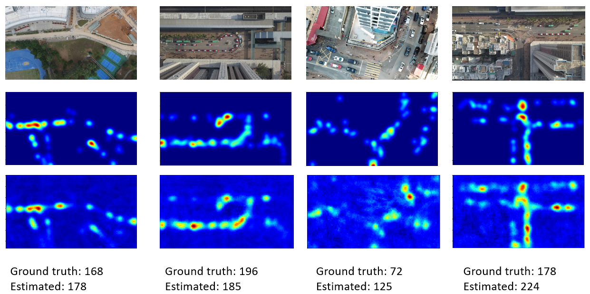
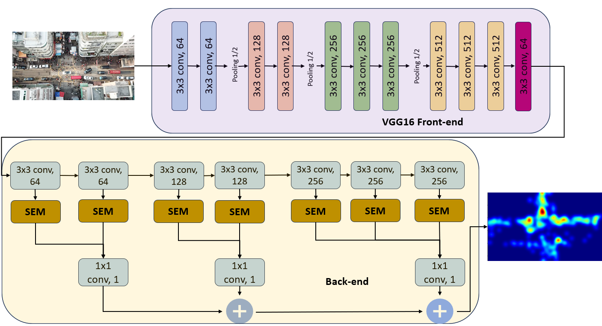

# Crowd Count Network

This repo contains our implementation of CrowdNet, a model for Human Crowd Detection from UAV Footage.



Human Crowd detection, a pivotal component of computer vision, has wide-ranging applications in video surveillance, public safety, and crowd analysis. This research explores the challenges and advancements in UAV-based crowd counting. The proposed Convolutional Neural Network (CNN) model combines VGG-16 for feature extraction and a specialized density estimation backend. Using the VisDrone2020-CC dataset, the model achieves a Mean Absolute Error of 68, revealing the complexities of occlusion and dynamic crowd scenarios. While indicating moderate performance, this study sets the stage for future improvements, emphasizing the need for advanced feature extraction techniques and comprehensive training datasets to enhance precision in UAV-based crowd-counting.



## Installation

1. Install [Python](https://www.python.org/downloads/). This repo running on python **3.9.18**. It's better to install and use Anaconda to manage your environment.
2. Install PIP, make sure it's the latest pip (only using python3) **(if you are not going the anaconda route)**

   ```bash
   python3 --version
   curl https://bootstrap.pypa.io/get-pip.py -o get-pip.py
   python3 get-pip.py
   python3 -m pip install --upgrade pip
   ```

3. Install the [CUDA Toolkit](https://developer.nvidia.com/cuda-toolkit) for GPU accelaration. If you do not have a nvidia GPU you can skip this and run the project with your CPU.
4. Install pytorch from their [site](https://pytorch.org/) and select the os and cude version you're running on. Example:

   `conda install pytorch==2.0.1 torchvision==0.15.2 torchaudio==2.0.2 pytorch-cuda=11.7 -c pytorch -c nvidia`

   If you are not running CUDA:

   `pip3 install torch torchvision torchaudio`
5. Set up a jupyter kernel to run the .ipynb notebooks.

   ```bash
   pip install jupyter
   python -m ipykernel install --user --name VL-MOT
   ```

6. Clone this repo, pip Install the requirements file

   `pip install -r requirements.txt`

## Quick Start: Running the Demo

To run the demo you will first need to download the prepared dataset and pretrained weights. You can find them here:

- [Dataset Download](https://kuacae-my.sharepoint.com/:u:/g/personal/100044982_ku_ac_ae/EVhf9Lp9B9xIlUFZCDJ9x40BvZpfq6QHWPSASYep4jT1qA?e=MhJIbi)
- [Weights Download](https://kuacae-my.sharepoint.com/:u:/g/personal/100044982_ku_ac_ae/EWgZ_4Qshw5GvvW4yJ3nD3sBKO7XjMQpgq1_fyTRGT2FOw?e=HxnGQO)

Place the dataset under the Data folder and unzip it. You should end up with this structure:

```
Data
   L dataset_resized
      L train
         L density_map
         L images
      L val
         L density_map
         L images
``````

Place the weights under the pretrained folder.

Run the following command to run the demo. Make sure you finished the installation above to have the required libraries installed.
`python demo.py --path Data/dataset_resized/val`

## Training and Evaluation

Download the official VisDrone-Dataset for Crowd Counting from [here](https://github.com/VisDrone/VisDrone-Dataset), place it under the Data folder and unzip it. You should end up with this structure:

```
Data
   L VisDrone2020-CC
      L annotations
         L 00001.txt
         ...
      L sequences
         L 00001
            00001.jpg
            ...
         ...
      L testlist.txt
      L trainlist.txt
```

Run the ***Dataset_Preparation.ipynb*** notebook. It wil walk you through creating the train, test, val sets, data resizing and the creation of the ground truth density maps. A new dataset directory will be created which will be used for the next part.

Run the ***Crowdnet.ipynb*** notebook. This notebook will walk you through:

- Data Loading and Feature Engineering
- Model Architecture and configuration
- Model Training (Weights will be saved under the 'pretrained' directory)
- Evaluation
- Visualization and Demo Inference

*Make sure the paths in the notebooks are appropriate as you go through it*.
